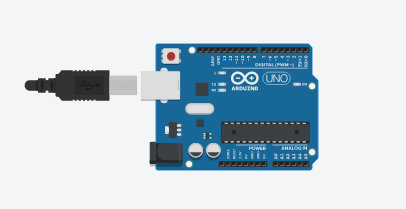
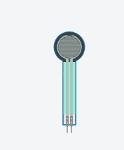
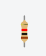
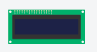

# iot
## Introduction

Le prototype permet :
  - Déterminer le trafic de vélo sur des piste cyclable et sur les routes.
  - Déterminer le trafic en fonction de la température .
  - Déterminer le trafic de vélo en en journée et de nuit .
  - Déterminer l'utilité des piste cyclable.
  cible le besoin de créer des piste cycle sur des route sans piste cyclable.

  ## Composant technique du compteur 

- Arduino Uno R3

- Capteur de température 

- 2 Force Sensor

- Résistance

- Capteur de lumière ambiante 

- Écran LCD 16x2 

